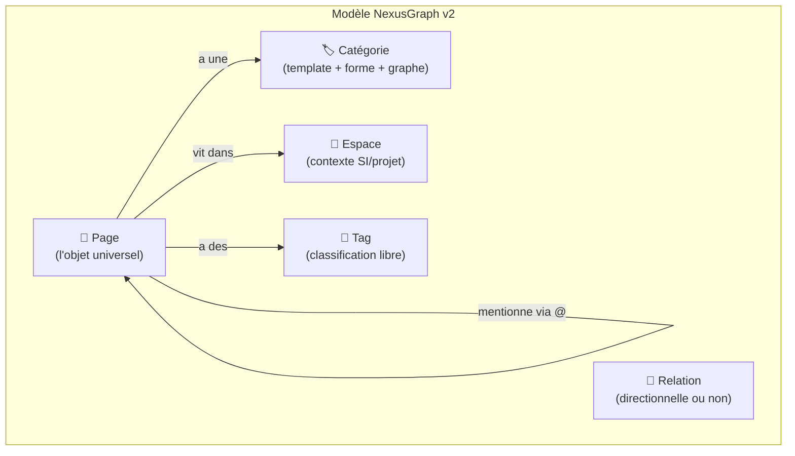

# NexusGraph — Challenges, Incohérences & Propositions v2

## 🔴 Partie 1 : Les incohérences que je dois pointer

### Incohérence #1 : "Note" vs "Entité" — tu as deux concepts pour le même objet

Tu ne comprends pas comment fonctionne la page Entité. C'est normal : **c'est parce que la distinction est artificielle.**

Pose-toi ces questions :
- "Protocole d'achat public" → c'est une note ou une entité ?
- "CR Réunion DSI" → c'est une note, mais elle a des propriétés (date, participants, projet)... comme une entité
- "Adil Bensaid" → c'est une entité, mais tu vas sûrement y écrire du texte libre ("Premier contact, bonne impression, expert Java")... comme une note

**Le problème** : dans le modèle actuel, tu dois décider si quelque chose est "une note" ou "une entité" au moment de la création. Cette décision est souvent impossible ou arbitraire. Et si tu te trompes, tu dois migrer l'un vers l'autre.

> [!CAUTION]
> **Deux systèmes parallèles (Notes + Entités) = double effort de gestion, confusion mentale, et données qui tombent entre les deux.**

---

### Incohérence #2 : Trois systèmes de classification

Tu as actuellement :
1. **Catégories** (pour les notes : Réunion, Point technique, Note générale...)
2. **Types d'entités** (pour les entités : Personne, Organisation, Projet...)
3. **Tags** (transversaux : Urgent, DSI, Budget...)

Catégories et Types font **exactement la même chose** : ils déterminent le template, l'icône, la couleur, et la forme sur le graphe. Avoir les deux en parallèle, c'est maintenir deux registres pour le même besoin.

---

### Incohérence #3 : "Une note peut optionnellement être une forme sur le graphe"

Si c'est un choix **manuel** à chaque note, ça crée de la friction. Tu vas finir par ne plus le faire. Et tes notes deviendront invisibles sur le graphe → le graphe perd sa valeur.

Si c'est un choix **par catégorie** (toutes les "Personnes" sont sur le graphe, aucune "Note générale" n'y est), c'est automatique et sans effort. Beaucoup plus viable.

---

### Incohérence #4 : Pas de modèle d'organisation multi-SI

Tu gères 4+ projets/SI différents. Mais dans le modèle actuel, toutes les notes sont dans une **liste plate unique**. Avec 50 notes pour "Migration SI" et 30 pour "Refonte Intranet" dans le même tas, tu vas recréer le chaos de OneNote.

---

## 🟢 Partie 2 : La refonte que je propose

### Proposition fondamentale : **"Tout est une Page"**

Inspiré de Tana (supertags) et Anytype (object types), je propose d'**éliminer la distinction Note/Entité**. Tout objet dans NexusGraph est une **Page**.

Une Page a :
| Composant | Description |
|-----------|-------------|
| **Titre** | Le nom (ex: "Adil Bensaid", "CR Réunion DSI") |
| **Catégorie** | Détermine le template, la forme graphe, l'icône (ex: Personne, Réunion, Projet) |
| **Propriétés** | Champs structurés définis par le template de la catégorie (optionnels) |
| **Contenu** | Texte libre rich-text avec @mentions (optionnel) |
| **Tags** | Classification transversale libre (Urgent, Budget, DSI...) |
| **Espace** | Le SI/projet auquel cette page est rattachée (ou "Global") |

**Exemples concrets :**

| Page | Catégorie | Espace | Sur le graphe ? | Propriétés | Contenu |
|------|-----------|--------|-----------------|------------|---------|
| Adil Bensaid | 👤 Personne | Global | ✅ Oui (auto) | Bureau, Tél, Rôle | "Expert Java, premier contact mars 2026..." |
| CR Réunion DSI | 📋 Réunion | Migration SI | ❌ Non (auto) | Date, Participants | Texte libre du CR |
| Service Informatique | 🏢 Organisation | Global | ✅ Oui (auto) | Direction, Étage | "Gère l'infra et le dev..." |
| Protocole d'achat | 📚 Savoir | Global | ✅ Oui (auto) | Domaine | Documentation du protocole |
| Notes perso lundi | 📝 Note libre | — (aucun) | ❌ Non (auto) | — | Brain dump quotidien |

> [!TIP]
> **Avantage clé** : Tu n'as plus jamais à te demander "est-ce une note ou une entité ?". Tu crées une Page, tu choisis sa catégorie, et le système fait le reste.

---

### Proposition #2 : Les "Espaces" pour organiser tes SI

Au lieu d'une liste plate de notes, je propose un concept d'**Espaces** :

```
SIDEBAR REPENSÉE :
─────────────────────────────────
📥  Capture rapide
─────────────────────────────────
🔵 ESPACES (tes SI / projets)
│
├── 🟢 Migration SI v2.0
│   ├── 📋 Réunions (3)
│   ├── 📄 Points techniques (5)
│   └── 📌 Suivi jalons (2)
│
├── 🟠 Refonte Intranet
│   ├── 📋 Réunions (2)
│   ├── 📄 Specs fonctionnelles (4)
│   └── 📝 Notes libres (1)
│
├── 🔵 Audit RGPD
│   └── ...
│
└── ➕ Nouvel espace
─────────────────────────────────
🌐 GLOBAL (transversal)
│
├── 👤 Personnes (8)
├── 🏢 Organisations (6)
└── 📚 Savoirs (5)
─────────────────────────────────
🕸️  Graph
⚙️  Paramètres
```

**La règle clé** :
- Les **pages opérationnelles** (Réunions, CR, points de suivi) vivent **dans un Espace**
- Les **pages référentielles** (Personnes, Organisations, Savoirs) vivent **en Global**
- Quand tu fais `@Adil` dans une note de "Migration SI", ça crée un lien entre l'Espace et l'entité globale
- Le graphe peut se **filtrer par Espace** pour ne voir que les relations d'un SI spécifique

> [!IMPORTANT]
> C'est le modèle "Hub & Spoke" de Notion croisé avec le graphe de Tana. Tes notes sont rangées par projet. Tes entités sont partagées entre projets. Et le graphe montre les connexions transverses.

---

### Proposition #3 : Catégories intelligentes (au lieu de Types + Catégories)

Un seul système unifié : les **Catégories**. Chaque catégorie définit :

| Propriété | Description | Exemple "Personne" | Exemple "Réunion" |
|-----------|-------------|--------------------|--------------------|
| **Nom** | Le label | Personne | Réunion |
| **Icône** | Emoji ou symbole | 👤 | 📋 |
| **Couleur** | Pour le graphe et les badges | `#8b5cf6` | `#3b82f6` |
| **Forme graphe** | Shape Cytoscape | `ellipse` | — (pas sur graphe) |
| **Visible sur graphe** | Auto ou non | ✅ Toujours | ❌ Jamais |
| **Espace par défaut** | Global ou à choisir | Global | Dans un Espace |
| **Template** | Champs pré-remplis | Nom, Bureau, Tél, Rôle | Date, Heure, Participants, Ordre du jour |

**Catégories par défaut que je propose** (tu peux en créer d'autres) :

| Catégorie | Sur graphe | Espace | Template |
|-----------|-----------|--------|----------|
| 👤 Personne | ✅ Oui | Global | Bureau, Service, Tél, Rôle |
| 🏢 Organisation | ✅ Oui | Global | Type (Bureau/Service/Direction), Rattachement |
| 📊 Projet | ✅ Oui | Global | État (🟢🟠🔴), Date début, Date fin |
| 📚 Savoir | ✅ Oui | Global | Domaine, Dernière MàJ |
| 📋 Réunion | ❌ Non | Espace | Date, Heure, Participants, Lieu |
| 📄 Note technique | ❌ Non | Espace | Sujet, Complexité |
| 📌 Point de suivi | ❌ Non | Espace | Date, Actions |
| 📝 Note libre | ❌ Non | Optionnel | — (aucun) |

> [!TIP]
> Le template s'affiche en haut de la page quand tu crées une note. Tu peux le remplir, le modifier, ou le supprimer — c'est un starter, pas un carcan. Tu peux aussi créer la catégorie "Décision", "Risque", "Formation"... ce que tu veux.

---

### Proposition #4 : Capture rapide — le "Quick Entry"

Un truc que tu n'as pas demandé mais qui va **changer ton workflow** :

Au lieu de naviguer vers un Espace → cliquer "Nouvelle page" → choisir la catégorie → commencer à écrire...

Un champ **"Capture rapide"** permanent en haut de la sidebar :
- Tu tapes directement ton texte
- Tu choisis l'Espace + Catégorie via un dropdown rapide
- La page est créée instantanément avec le template pré-rempli
- Tu peux continuer à écrire dedans ou y revenir plus tard

**Cas d'usage** : Tu sors de réunion, tu ouvres NexusGraph, tu tapes "CR Réunion budgets Migration" → tu sélectionnes Espace "Migration SI" + Catégorie "Réunion" → le template apparaît → tu remplis.

> Ça résout le problème de la "saisie à la volée" de OneNote, mais avec un minimum de structure dès le départ.

---

### Proposition #5 : Backlinks automatiques (la killer feature cachée)

C'est le concept qui fait la puissance d'Obsidian et Roam. Voici comment je l'adapte :

Quand tu écris `@Adil Bensaid` dans une note de "Migration SI", le système fait **automatiquement** :
1. Crée un lien dans la table `mentions` ✅ (déjà prévu)
2. **Affiche cette note dans la section "Notes associées" de la page Adil** ✅ (backlink)
3. **Suggère la création d'une relation "travaille sur → Migration SI"** si elle n'existe pas encore 🆕

C'est ça la puissance : **les relations émergent de tes notes**. Tu n'as pas à aller manuellement créer des relations dans un outil séparé. Tu écris naturellement, et le graphe se construit tout seul.

> [!IMPORTANT]
> Concrètement, sur la page d'Adil Bensaid, tu verrais :
> - **Backlinks** : toutes les notes qui le mentionnent, groupées par Espace
> - **Relations suggérées** : "Adil est mentionné dans 3 notes de Migration SI → Créer la relation 'travaille sur' ?"
> - **Relations confirmées** : celles que tu as validées

---

### Proposition #6 : "Context Card" au survol

Quand tu survoles un `@mention` dans l'éditeur, une **carte contextuelle** apparaît :

```
┌─────────────────────────────────┐
│ 👤 Adil Bensaid                 │
│ Chef de projet technique        │
│ Service Informatique            │
│ Bureau B-312 · 01 44 56 78 90  │
│ ─────────────────────────────── │
│ 🟢 Migration SI · 📋 3 notes   │
│ 🟠 Refonte Intranet · 📋 1 note│
│ ─────────────────────────────── │
│ [Ouvrir la fiche]  [Voir graph] │
└─────────────────────────────────┘
```

Pas besoin de quitter ta note pour savoir qui est la personne, dans quels projets elle est impliquée, et comment la contacter. **C'est ça, l'accélérateur de contexte.**

---

### Proposition #7 : Formes différenciées sur le graphe

Tu as demandé des formes différentes par type. Voici ma proposition de mapping :

| Catégorie | Forme Cytoscape | Couleur | Taille |
|-----------|----------------|---------|--------|
| 👤 Personne | `ellipse` (cercle) | Indigo `#8b5cf6` | 40px |
| 🏢 Organisation | `round-rectangle` | Ambre `#f59e0b` | 48×36px |
| 📊 Projet | `hexagon` (hexagone) | Émeraude `#10b981` | 50px |
| 📚 Savoir | `diamond` (losange) | Rose `#ec4899` | 38px |
| Custom | `round-tag` ou `star` | Couleur au choix | 40px |

Les formes + couleurs + tailles rendent le graphe **lisible sans légende** une fois qu'on a pris l'habitude.

---

## 🟡 Partie 3 : Ce que je challenge encore

### Challenge 1 : La "Capture rapide" versus la "Structure"
Tu dis que tu notes "à la volée" et que ça crée du chaos dans OneNote. Mais si NexusGraph demande trop de structure (choisir l'Espace, la catégorie, remplir le template) à chaque prise de note, tu vas résister et retourner à OneNote.

**→ Solution** : Le champ "Capture rapide" doit permettre de créer une note **sans rien remplir**. Catégorie "Note libre", pas d'Espace, pas de template. Tu ranges après. C'est le concept de "inbox zero" appliqué aux notes.

### Challenge 2 : Les Espaces vont-ils devenir des silos ?
Si chaque Espace est trop isolé, tu recrées les onglets OneNote. L'intérêt de NexusGraph c'est justement les **liens transverses**.

**→ Solution** : Le graphe global montre les ponts entre Espaces. Et les entités Globales (Personnes, Orgs) sont les nœuds de jonction naturels. C'est Adil qui fait le lien entre "Migration SI" et "Refonte Intranet" parce qu'il est mentionné dans les deux.

### Challenge 3 : Complexité perçue au premier lancement
Tu auras : Espaces, Catégories, Tags, Templates, Graphe, Capture rapide... C'est beaucoup de concepts à absorber pour un premier lancement.

**→ Solution** : Un **onboarding guidé** au premier lancement. 3 étapes :
1. Crée ton premier Espace (ton SI principal)
2. Crée ta première page (une personne ou une réunion)
3. Crée un lien avec `@mention`

Après ces 3 étapes, l'utilisateur comprend 80% du système.

### Challenge 4 : Combien de catégories avant le chaos ?
Si tu crées 20 catégories, tu ne sauras plus laquelle choisir à chaque nouvelle page.

**→ Solution** : Limiter à ~10 catégories max. Les catégories qu'on n'utilise pas depuis 30 jours sont grises dans le sélecteur. Les plus utilisées sont en premier.

---

## 📐 Partie 4 : Résumé du modèle repensé



**En résumé :**
- ❌ Plus de distinction Note / Entité
- ❌ Plus de double système Types + Catégories
- ✅ Un seul objet : la **Page**
- ✅ Un seul système de classification : les **Catégories**
- ✅ Organisation par **Espaces** (tes SI)
- ✅ **Tags** pour le cross-cutting
- ✅ **Backlinks automatiques** depuis les @mentions
- ✅ **Context Cards** au survol
- ✅ **Capture rapide** sans friction
- ✅ Graphe visible **automatiquement** selon la catégorie
